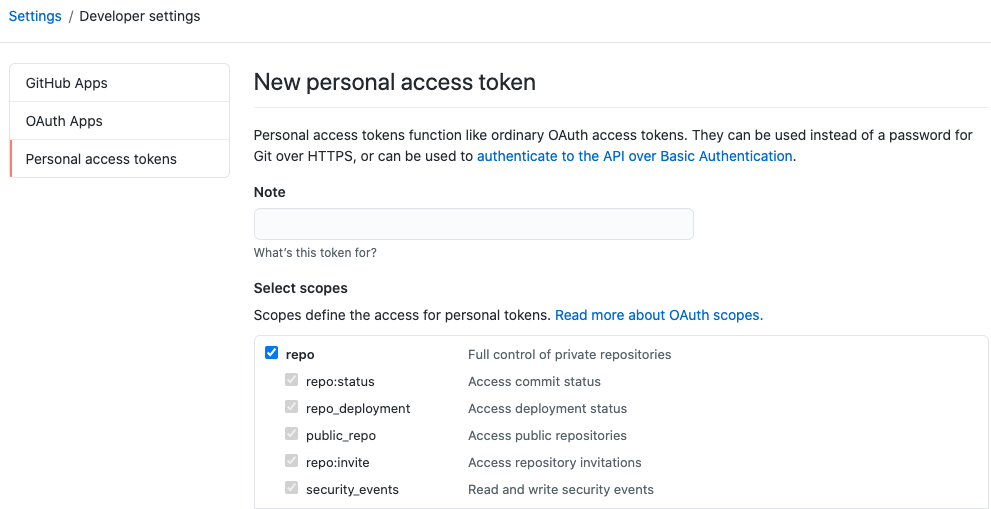
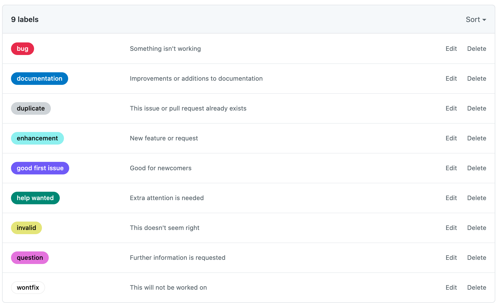
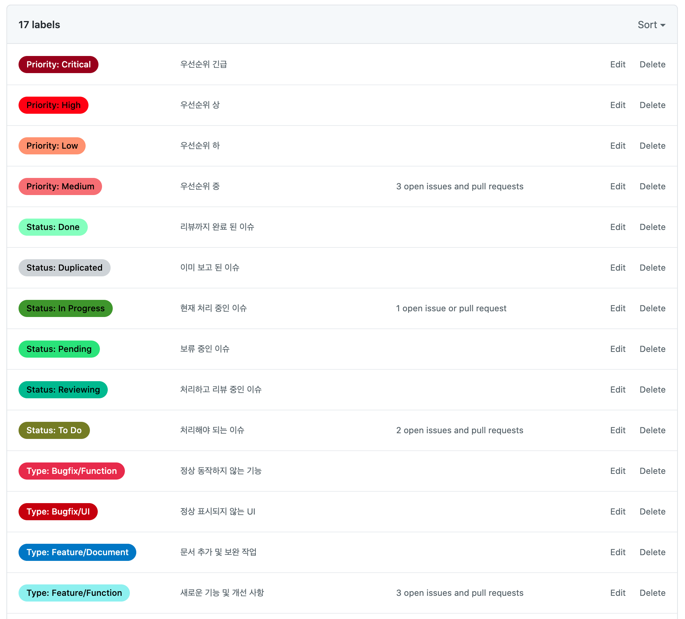
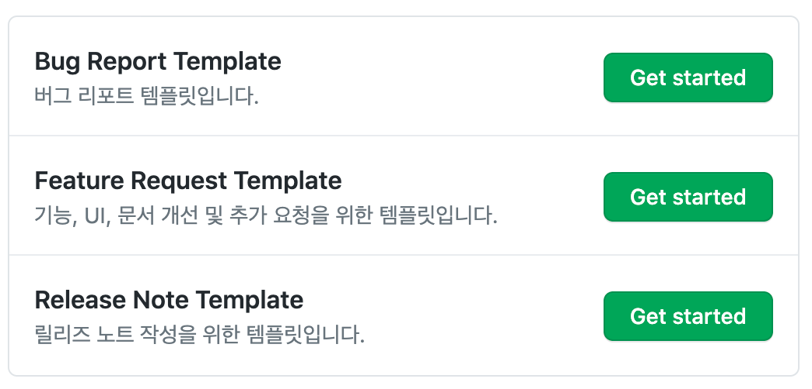
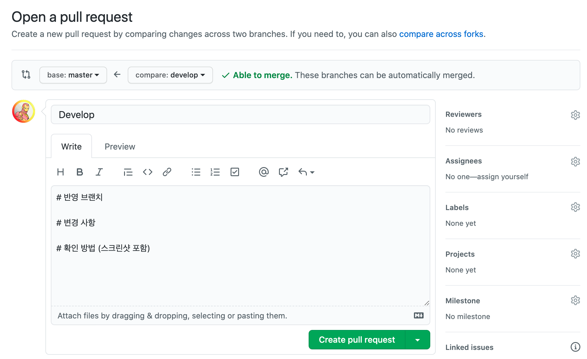

# Github Label 세팅

## Label 이란?
- Issue, PR 에 붙여서 분류하기 위한 이름표

## Github 액세스 토큰 발급
[https://github.com/settings/tokens](https://github.com/settings/tokens)
- `Generate new token` 클릭
- 원하는 이름 입력
- `scopes`에서 repo 선택



## Label 정의하기
- `labels.json` 파일에 JSON Array 형태로 정의
- `name`, `color`, `description` 을 정의할 수 있음
```json
[
  {
    "name": "Priority: Critical",
    "color": "8c001a",
    "description": "우선순위 긴급"
  }
]
```

## 정의 된 Label 적용하기
- `액세스 토큰`, `계정명`, `저장소 이름`을 자신의 것으로 변경
```sh
npx github-label-sync --access-token [액세스 토큰] --labels labels.json [계정명]/[저장소 이름]
```

### Label 설정 적용 전


### Label 적용 후



# Issue Template
`Issues` 탭에서 `New issue` 버튼을 눌렀을 때 미리 정의 된 템플릿을 선택할 수 있음

## Issue Template 정의하기
- 마크다운 형식으로 파일 생성
- `name`, `about`, `title`, `labels`, `assignees`를 미리 지정할 수 있음
- labels 의 경우 위에서 정의 한 label name을 지정하면 됨 

## 예시
```markdown
---
name: Bug Report Template
about: 버그 리포트 템플릿입니다.
title: ''
labels: 'Status: To Do, Priority: Medium, Type: Bugfix/Function, Type: Bugfix/UI'
assignees: ''
---

# 발생 일시

# 발생 위치

# 증상

# 재현 방법

# 스크린샷

```

## Issue Template 적용
- 추가 된 파일을 github 원격에 push 한 후 `New issue` 버튼을 누르게 되면 아래와 같이 선택 화면이 나옴



# Pull Request Template
- 마크다운 형식으로 파일 생성
- `pull_request_template.md`로 파일 이름 지정

## 예시
```markdown
# 반영 브랜치

# 변경 사항

# 확인 방법 (스크린샷 포함)
```

## Pull Request Template 적용


# 참고
- [github-label-sync](https://github.com/Financial-Times/github-label-sync)
- [Using templates to encourage useful issues and pull requests](https://docs.github.com/en/free-pro-team@latest/github/building-a-strong-community/using-templates-to-encourage-useful-issues-and-pull-requests)